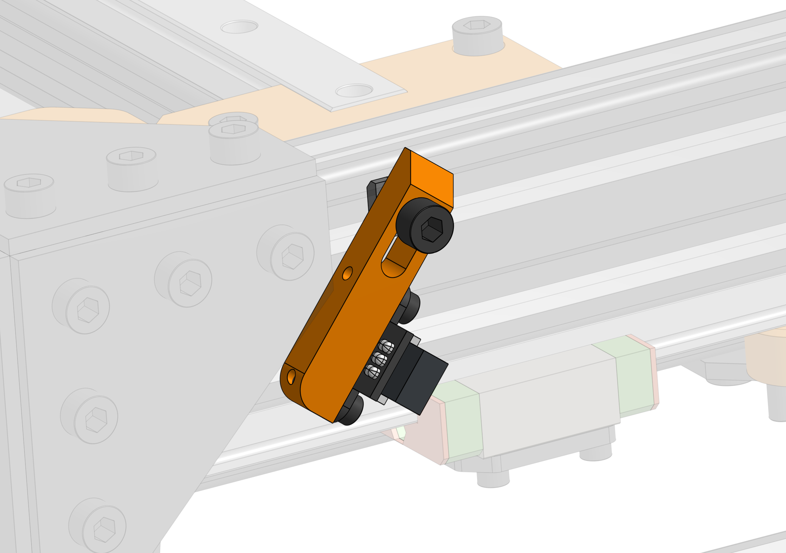
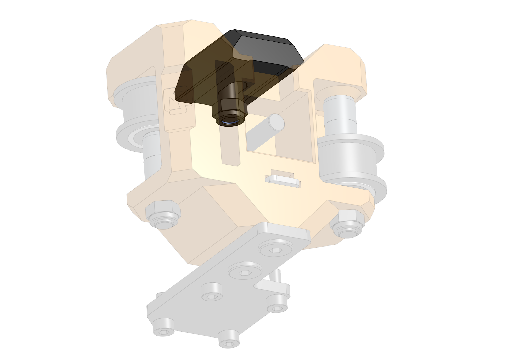

# Endstops

Easy Mod does not come with mechanical switch endstops but here are some simple solutions that address the problem.

## Y min/max 

There's a simple part that can act as a mount to the "angled endstops" [AliExpress](https://www.aliexpress.com/item/32837967235.html)

## X endstop block

Much like on V-Core 3 you can use a simple stop block for an EVA endstop to bump against.

## Combined BOM

{{ get_bom("endstops") | md_table }}
