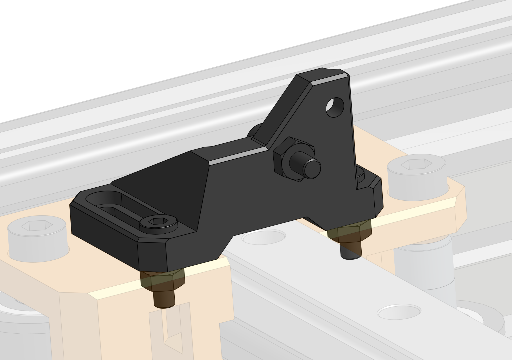

# Endstops

Easy Mod does not come with mechanical switch endstops but I will still share the parts that I use. 

## Y min/max 

There's a simple part that can act as a mount to the "angled endstops" [AliExpress](https://www.aliexpress.com/item/32837967235.html)

## X endstop block

A simple block that EVA's endstop can bump against. It has holes that can receive a screw to adjust the X min position - this should be redundant on EVA 2. The block is screwed on the XY Joiner.

## Combined BOM

{{ bom("bom/BOM_Endstops.csv", 0) }}
