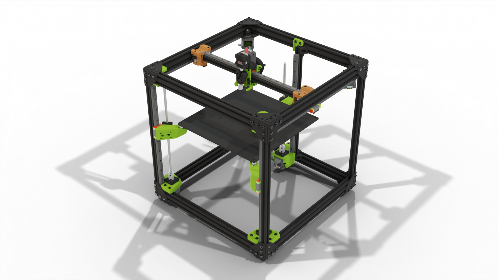

# Easy Mod

"Easy Mod" is a modification for the Rat Rig V-core Pro printer. Enables V-core Pro to use the [EVA platform](https://main.eva-3d.page){target=_blank}.

Up to Easy Mod 1.2.1 there is no additional hardware required to use Easy Mod on V-core Pro. Scroll down for more information about the specific versions and what's planned for the future.

### Printing

You can print the parts with 0.2mm or even 0.3mm layer height. Use 4 perimeters to make them strong (~1.8mm wall width), infill is not that important - 20% will be fine. **No supports needed**.

### Roadmap

## Attributions

Big thanks to [Simon Davie](http://www.nexxdesign.co.uk/) for double checking the measurements and belt paths.

## Issues

In case of issues or ideas please file an issue here: https://github.com/EVA-3D/easy-mod/issues

## Contact

If you need a more direct contact I'm on the [Rat Rig Unofficial Discord Server](https://discord.gg/DcCEk8u).

