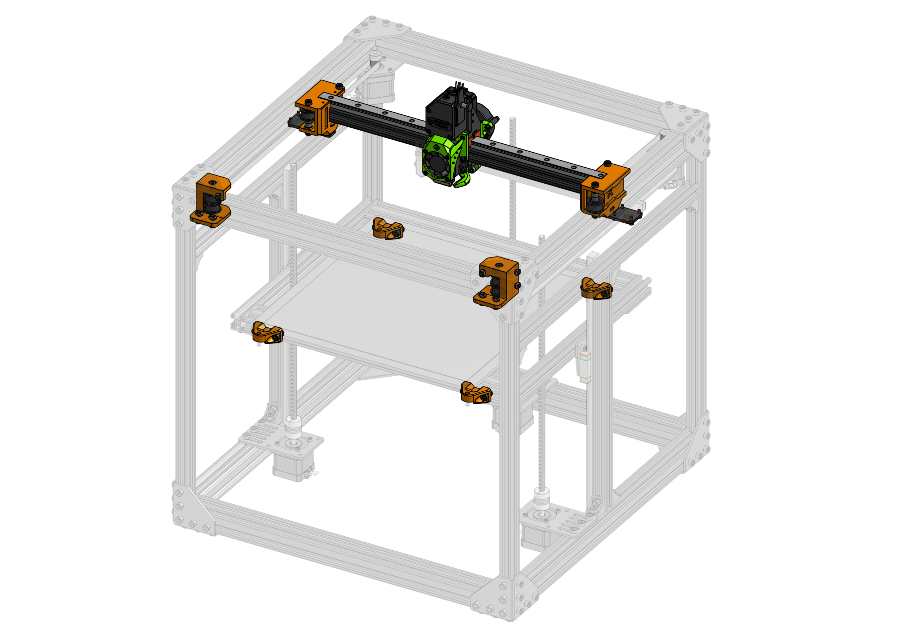
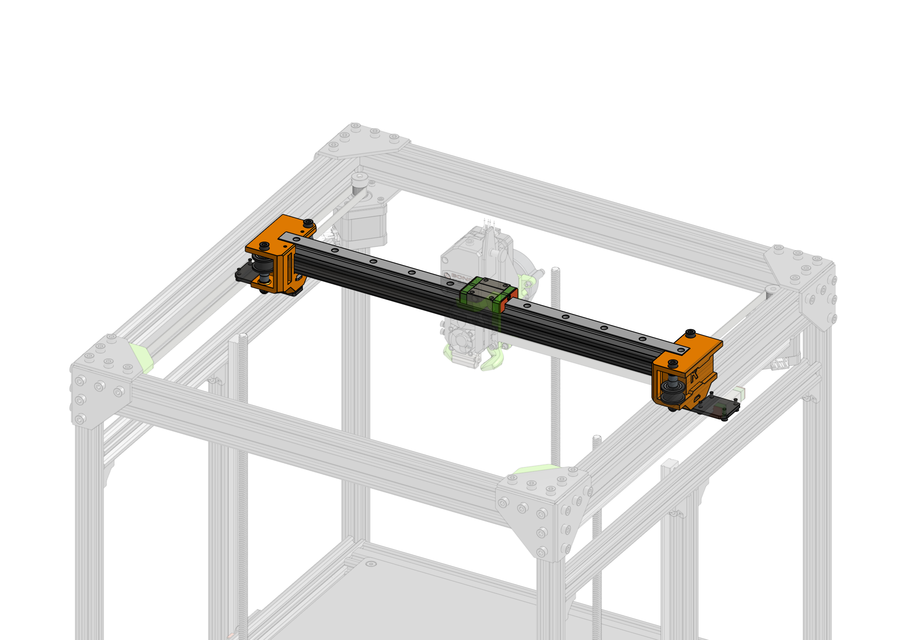

# Easy Mod

"Easy Mod" is a modification for the Rat Rig V-core Pro printer. Enables V-core Pro to use the [EVA platform](https://main.eva-3d.page){target=_blank}.

Up to Easy Mod 1.2.1 there is no additional hardware required to use Easy Mod on V-core Pro. Scroll down for more information about the specific versions and what's planned for the future.

### Printing

You can print the parts with 0.2mm or even 0.3mm layer height. Use 4 perimeters to make them strong (~1.8mm wall width), infill is not that important - 20% will be fine. **No supports needed**.

### Roadmap

#### 2.0.0 (Future)

This release is going to be around reducing the weight of the X gantry of V-core Pro by shifting to a MGN12 rail.

#### 1.2.1 (Current)

This version gives back the Y space that Easy Mod originally stole. To regain that Y one needs to do one of two things:

1. use the included `bed_corner` parts that move the bed -10mm in Y
2. move the whole gantry -10mm in Y (this will be difficult on 3 axis V-core)

I used those `bed_corner` parts for a very long time on my V-core - nothing melted (PETG).

##### Upgrade from 1.2.0

The `xy_joiner` parts did not change. The `corner` and `bed` parts are new. 

##### BOM

{{ bom("bom/1.2.1.csv", 0) }}

#### 1.2.0

Added compatibility with the new EVA 2 belt mounting system. 

##### Upgrade from 1.1.0

To upgrade one needs to reprint the `xy_joiner` parts. No hardware requirements change in this release.

##### BOM

{{ bom("bom/BOM_X gantry.csv", 0) }}

#### 1.1.0 (Obsolete)

Easy Mod 1.0.0 - 1.1.0 is compatible with EVA up to it's version 2.0.0. If you are planning on using EVA 2 on V-core Pro, you need to update to Easy Mod 1.2.0. Visit [:octicons-mark-github-16: tag: 1.1.0](https://github.com/EVA-3D/Easy-Mod/tree/1.1.0) for the old files.

## Attributions

Big thanks to [Simon Davie](http://www.nexxdesign.co.uk/) for double checking the measurements and belt paths.

## Issues

In case of issues or ideas please file an issue here: https://github.com/EVA-3D/easy-mod/issues

## Contact

If you need a more direct contact I'm on the [Rat Rig Unofficial Discord Server](https://discord.gg/DcCEk8u).

