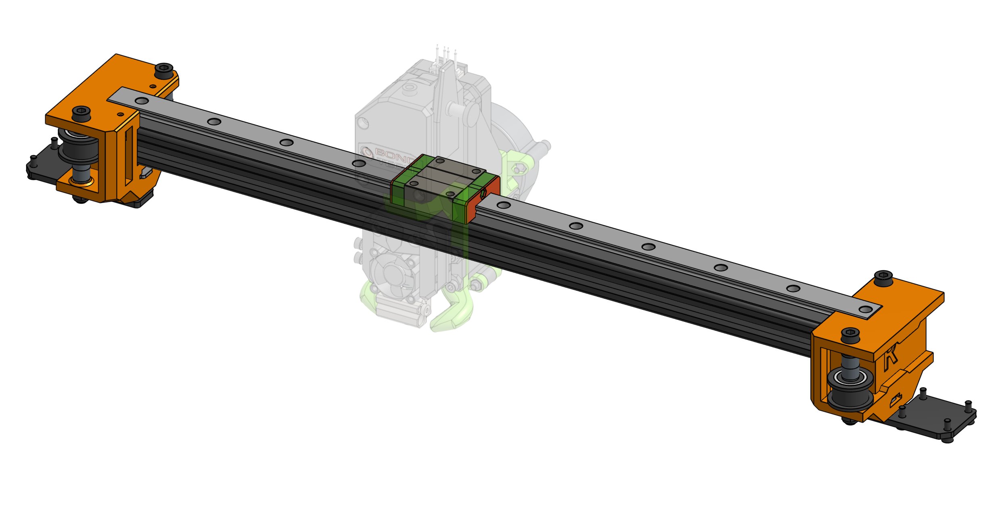

# Easy Mod

"Easy Mod" is a modification for the Rat Rig V-core Pro printer. Enables V-core Pro to use the [EVA platform](https://eva-3d.github.io/eva-main/).

Up to Easy Mod 2.0.0 there is no additional hardware required to use Easy Mod on V-core Pro. Scroll down for more information about the specific versions and what's planned for the future.

### Roadmap

#### 1.1.0 (Obsolete)

Easy Mod 1.0.0 - 1.1.0 is compatible with EVA up to it's version 2.0.0. If you are planning on using EVA 2 on V-core Pro, you need to update to Easy Mod 1.2.0. Visit [:octicons-mark-github-16: tag: 1.1.0](https://github.com/EVA-3D/Easy-Mod/tree/1.1.0) for the old files.

#### 1.2.0 (Current)

Added compatibility with the new EVA 2 belt mounting system. To upgrade one needs to reprint the `xy_joiner` parts. No hardware requirements change in this release.

##### BOM

{{ bom("bom/BOM_X gantry.csv", 0) }}

#### 2.0.0 (Future)

This release is going to be around reducing the weight of the X gantry of V-core Pro by shifting to a MGN12 rail.

