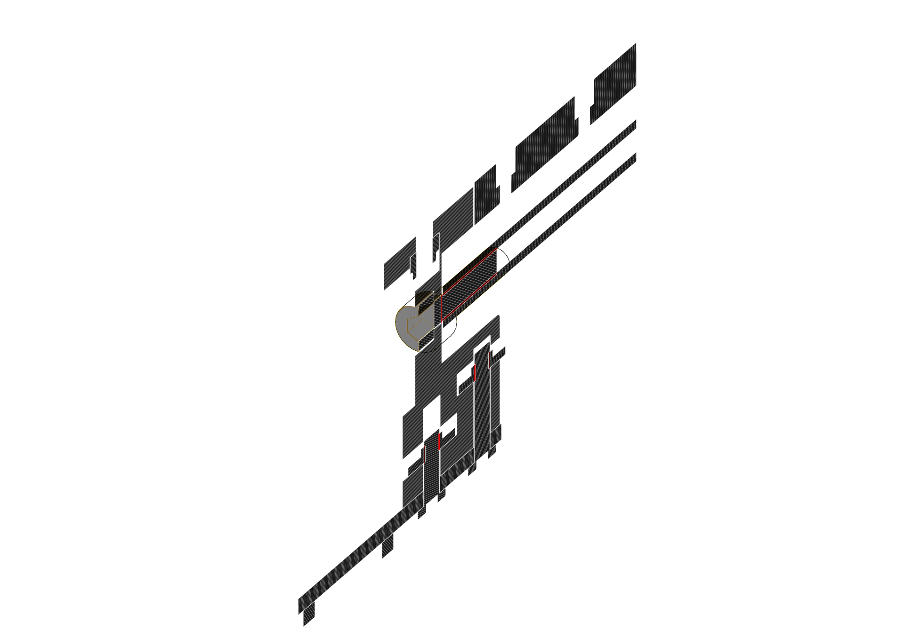

# 2.0.0 

> Compatibility: EVA >= 2.4.0

An MGN12 rail is ~60% of the weight of a MGN15 rail. EVA is dropping support for MGN15 in version 2.4.0 for that and other reasons like easier maintenance. 

Now to leave V-Core Pro users locked from EVA updates this *final* version of Easy Mod is prepared.

## Two variants

To make the transition to MGN12 easier and hopefuly cheaper two variats of the `xy_joiner` parts are made.

### Variant A

This one is made in hope that a 400mm rail will be available more easily then a 420mm one, does require a new 2020 extrusion though. 

| Hardware         | Length     | Comment              |
| ---------------- | ---------- | -------------------- |
| 2020 extrusion   | 420mm      | Need to buy          |
| MGN12 rail       | 400mm      | Available at Rat Rig |

#### BOM

{{ bom_to_md_table("2.0.0_A.csv", 0) }}

### Variant B

This one reuses the same 394mm 2020 extrusion but requires a 420mm rail that might be harder to get.

| Hardware         | Length     | Comment              |
| ---------------- | ---------- | -------------------- |
| 2020 extrusion   | 394mm      | Same as V-Core Pro   |
| MGN12 rail       | 420mm      | Need to buy          |

#### BOM

{{ bom_to_md_table("2.0.0_B.csv", 0) }}

## XY idlers

Those did not change from the previous version.

## Features

Optional `M5x20mm` screws was added to where the 2020 extrusion ends meet the `xy_joiners`

The whole design is based of the V-Core 3 design (V-Core 3 ideas started with Easy Mod so it's a full circle now :smile:). With that we have the single M5 bolt on the top of the part, much like on V-Core 3 but due do the differences between the two printers and the B variant 100% compatibility was not achieved.

