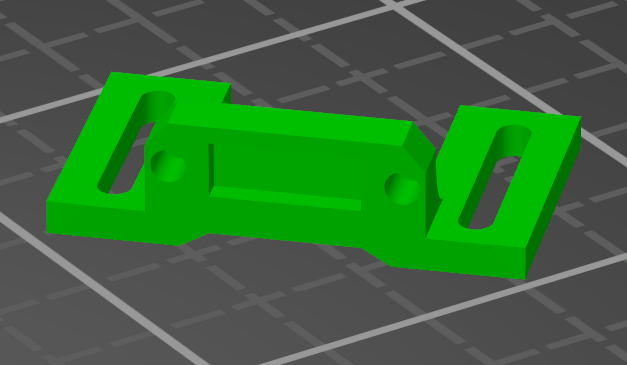

> Created by: Shufflez

## Description
I'm running pre 2.0 EasyMod (RatRigs V-Core 1.3=> upgrade kit), with the 'flat' XY-joiner.
Didn't want endstop on my carriage and got fed-up with sensorless homing.
So whipped up a quick and (very, very) dirty Y-idler X-endstop mount :).
At least it gets me printing.

Fits the [Genmitsu CNC-endstops](https://www.amazon.de/-/en/Genmitsu-Switch-3018-PROVER-3018-MX3-3018-PROVer/dp/B08P1D6WTR).
There's room for the pins on backside and about 20mm of adjustability (using with extended EasyMod's endstop-trigger-push-thingy on EVA carriage).

## BOM
| No | Qty | Name                                           | Printable |
| -- | --- | ---------------------------------------------- | --------- |
| 1  | 1   | Y-Idler X-endstop mount                        | [Yes](stl/xy-joiner_x-endstop.stl) |
| 2  | 1   | [Genmitsu CNC-endstops](https://www.amazon.de/-/en/Genmitsu-Switch-3018-PROVER-3018-MX3-3018-PROVer/dp/B08P1D6WTR)| No        |
| 3  | 2   | DIN 912 M3 6mm     | No        |
| 4  | 2   | M3 Nut (place inside idler's designated spots) | No        |
| 5  | 2   | DIN 912 M3 8mm (to mount the mount on idler)     | No        |
| 6  | 2   | Optional M3 Nut (6mm M3's should tap into the plastic well enough) | No        |

## Compatible EasyMod version
1.2.1 I think.

## Print instructions
Print it so that the 'legs' are flat on the bed. I printed in all perimeters.
